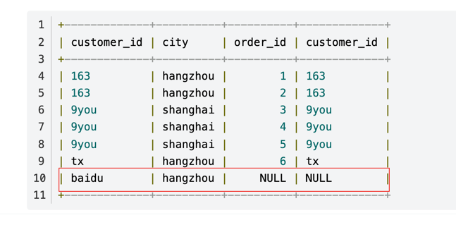

### SQL执行顺序

```sql
1, from
2, on 
3, join
4, where
5, group by
6, having 
7, select 
8, distinct 
9, order by
10,limit
```

#### 详解sql执行步骤

```sql
(7)     SELECT 
(8)     DISTINCT <select_list>
(1)     FROM <left_table>
(3)     <join_type> JOIN <right_table>
(2)     ON <join_condition>
(4)     WHERE <where_condition>
(5)     GROUP BY <group_by_list>
(6)     HAVING <having_condition>
(9)     ORDER BY <order_by_condition>
(10)    LIMIT <limit_number>
```
1.执行`from`以后，会生成 left + right表的笛卡尔积，记作 `vitual_table1`

2.执行`on`条件，筛选出符合条件的数据,结果集记作 `virtual_table2`

3.添加外部行
只有当连接类型是`out join`时,也就是 left join,right join,full join时，才会执行此步骤
left join就是将左表作为基准表，只要是左表里有的，结果集里就会显示出来，



如上图，baidu和hangzhou只在左边表中有值，右边没有值，但是结果集也显示出来了。
right join也是类似的，而full join则是全集，会将2张表中所有的数据都作为结果集展示出来。
执行完这一步过后又会得到一个结果集，记作 `virtual-table3`

4.执行`where`对`virtual-table3`进行条件过滤，得到`virtual-table4`

5.执行`group by`,对`virtual-table4`进行分组，得到`virtual-table5`

6.执行`having`过滤，得到`virtual-table6`

7.执行`select`,此时 `select`的操作是从`virtual-table6`中取的，所以一些字段如果是同时出现在几张表中的，那么查询的时候
需要使用tableName.column指定，`但是如果某一个字段是独一无二的，仅仅只出现在了一张表中，那么使用table.column反而会出错。`*在oracle数据库中实践所得结论，或许不能代表一般性*

8.distinct

9.order by `此时order by后接的字段，如果在select语句中已经指定了别名，那么请使用别名作为排序字段名，使用原来的字段名将失效` *原因是因为，order by的结果集来自distinct,
而distinct的结果集来自select后生成的结果集*

#### MySql

- 脏读：读未提交。
- 幻读：A事务窗口对table作出了全表修改，B事务此时提交一条insert，此时在事务A中select可以查询到B事务新增的这条数据，
仿佛并没有执行全表修改sql。
- S锁和X锁--->就是读锁（***读读可以共存***）和写锁（***互斥锁***）
>MySql ***S锁*** 使用方式：
> 
> 1.select * from XXX for update 
> 
> 2.select * from XXX in share mode


